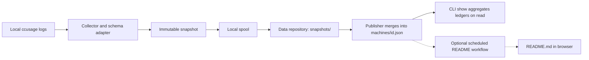

# Fleet Usage implementation plan

Status: revised 2026-09-08 (snapshot revision accepted, see revision-snapshots.md); implementation in progress, first implementation entry HIST-004.
Revised 2026-09-08: snapshot revision accepted (see
[revision-snapshots.md](revision-snapshots.md)).

Created: 2026-09-08.

Tracking: [QA gates](qa-gates.md) and
[implementation history](implementation-history.md).

## 1. Objective and constraints

Build an installable CLI that publishes local ccusage statistics hourly to
GitHub and lets any configured machine fetch and display aggregate fleet usage.
Manual publication must remain available. No continuously running custom
service or inbound connection between fleet machines is required.

The initial fleet consists of:

| Machine | Operating system | Expected role |
| --- | --- | --- |
| Development workstation | Windows | Publisher and viewer |
| Mobile machine | Fedora | Publisher and viewer, intermittently connected |
| Server 1 | Debian 11 | Publisher and optional viewer |
| Server 2 | Debian 13 | Publisher and optional viewer |
| Server 3 | Debian 13 | Publisher and optional viewer |

Required coding conventions:

- uv-managed, installable Python package with a `src` layout.
- PEP 8, type hints, single-quoted string literals, NumPy-style docstrings,
  and no `from __future__ import annotations`.
- Ruff linting and formatting. Proposed line length: 79 characters.
- Local `settings.toml` and adjacent `.env` for secrets, located with platformdirs.
- Installation, inspection, and removal of scheduled publishing on Unix and
  Windows.
- Checkable implementation and QA work with an ongoing history.

Ordinary Python strings use single quotes. Docstrings follow Ruff's normal
triple-double-quote formatting and the NumPy documentation convention.

## 2. Decisions and proposed defaults

| Topic | Decision or proposed default | Status |
| --- | --- | --- |
| Architecture | Every machine pushes immutable snapshots and its own derived ledger; viewers aggregate on read | Agreed (revised 2026-09-08) |
| Repository split | Code repository plus separate private data repository | Agreed |
| Publishing | Hourly scheduling plus manual invocation | Agreed |
| Offline operation | Local spool of pending snapshots and cached ledger viewing | Agreed (revised 2026-09-08) |
| Windows default | Schedule under the user while logged in | Agreed |
| Windows alternative | Optional logged-out execution; S4U tested before password-backed logon | Agreed (revised 2026-09-08) |
| Aggregator | No central aggregator; optional scheduled README workflow | Agreed (revised 2026-09-08) |
| Freeze window | 5 days; a daily record settles once observed that long after the day ended | Proposed default |
| Package name | `fleet-usage`, import package `fleet_usage` | Proposed default |
| Python floor | Python 3.12+, with uv-managed Python as needed | Proposed default |
| Sources | One unified `ccusage daily --json --by-agent` call; `agents` lists the expected agents | Verified 2026-09-08 with ccusage 20.0.20 |
| Authentication | Repository-scoped GitHub token in local `.env` | Proposed default; authentication question unanswered |
| Reporting timezone | `Europe/Berlin` across the fleet | Proposed default |
| Unix scheduling | systemd user timer and user crontab both in v1; `auto` selects | Proposed default (revised 2026-09-08) |
| Initial visualization | Rich CLI tables, JSON/CSV, GitHub Markdown README | Proposed default |

Do not treat unanswered source/authentication preferences as explicit selections.
The defaults allow implementation planning to proceed; record any later choice
and its impact before implementing a conflicting transport or source contract.

The actual GitHub owner, repository names, code-repository visibility, machine
labels, source installations, and credentials remain deployment inputs.

## 3. Architecture



GitHub is the durable shared observation store. Snapshots are the truth; each
machine's ledger is derived from its own snapshots and must be reproducible
from them by `rebuild`. Local state coordinates publication only and holds
nothing that cannot be recovered from the remote except not-yet-uploaded
spool files.

Reading a report does not collect new usage from other machines. Snapshot
collection, ledger update, and viewing have separate timestamps.

## 4. Package structure and dependencies

```text
fleet-usage/
├── pyproject.toml
├── uv.lock
├── .python-version
├── README.md
├── docs/plans/
├── src/fleet_usage/
│   ├── __init__.py
│   ├── __main__.py
│   ├── py.typed
│   ├── cli.py
│   ├── config.py
│   ├── models.py
│   ├── collector.py
│   ├── snapshot.py
│   ├── spool.py
│   ├── ledger.py
│   ├── publisher.py
│   ├── github.py
│   ├── reporting.py
│   ├── readme_render.py
│   ├── scheduling/
│   │   ├── base.py
│   │   ├── cron.py
│   │   ├── systemd.py
│   │   └── windows.py
│   └── templates/
├── tests/
│   ├── fixtures/
│   ├── unit/
│   └── integration/
└── .github/workflows/ci.yml
```

`readme_render.py` is dependency-free (standard library only) so that
`repo init` can copy it verbatim into the data repository as
`scripts/render_readme.py`. Keep the README workflow template in package
resources so installed tools can bootstrap a data repository without a source
checkout. The code repository's own CI validates the package, not private
fleet usage.

Proposed runtime dependencies:

| Dependency | Purpose |
| --- | --- |
| Typer and Rich | CLI commands and terminal presentation |
| HTTPX | GitHub API requests, timeouts, and conditional downloads |
| Pydantic | Validated configuration and versioned payload schemas |
| platformdirs | Per-user configuration, state, cache, and log paths |
| python-dotenv | Explicitly located secret-file loading |
| filelock | Cross-platform process exclusion |

Use standard-library `tomllib`, `decimal`, `hashlib`, `zoneinfo`, and
`importlib.resources` where appropriate. SQLite is no longer used. Add a TOML
writer only if configuration editing requires it; initial template creation
does not require another dependency. Use Ruff, mypy, and pytest as development
dependencies.

## 5. Configuration contract

Use platformdirs with application name `fleet-usage`, `appauthor=False`, and
non-roaming Windows storage. Honor XDG overrides and explicit `--config` paths.

| Data | Location policy |
| --- | --- |
| `settings.toml`, `.env` | User configuration directory |
| Spool directory and process lock | User state directory |
| Downloaded ledgers and HTTP metadata | User cache directory |
| Rotating execution logs | User log directory |

Some Windows directory categories may resolve to the same base. Use distinct
filenames/subdirectories so cache cleanup cannot remove configuration or state.

Example settings:

```toml
schema_version = 1

[machine]
id = 'generated-persistent-uuid'
label = 'fedora-mobile'

[github]
repository = 'OWNER/fleet-usage-data'
branch = 'main'
token_env = 'FLEET_USAGE_GITHUB_TOKEN'

[collector]
command = ['bunx', 'ccusage@20.0.20']
version = '20.0.20'
agents = ['claude', 'codex']
timezone = 'Europe/Berlin'
timeout_seconds = 180
offline_pricing = true

[ledger]
freeze_window_days = 5

[schedule]
backend = 'auto'

[report]
default_period = 'month'
stale_after_hours = 3
```

Example adjacent `.env`:

```dotenv
FLEET_USAGE_GITHUB_TOKEN=replace-locally
```

Precedence: explicit command options, supported environment overrides,
`settings.toml`, then defaults. Process environment overrides `.env` secrets.
Never search arbitrary parent directories or the current directory for `.env`.
Resolve relative paths against the selected settings file's directory.

The shared `fleet.toml` defines expected machine identities, reporting
timezone, accepted schema/collector policy, and the freeze window. Reject
incompatible collection settings instead of mixing unlike daily buckets. A
policy change that changes historical bucket meaning requires a recorded
migration/rebuild decision, not an ordinary incremental publication.

One publisher identity exists per OS user per machine. `init` prints the
machine entry; `repo register` appends it to `fleet.toml`.

Never serialize settings or credentials wholesale into usage observations.
Create Unix secret files with restrictive permissions; document and inspect
Windows user access controls. Windows task-account passwords never enter `.env`.

## 6. CLI contract

```text
fleet-usage init
fleet-usage doctor
fleet-usage config show
fleet-usage repo init --repo OWNER/fleet-usage-data
fleet-usage repo init --repo OWNER/fleet-usage-data --create
fleet-usage repo init --update
fleet-usage repo register
fleet-usage publish
fleet-usage publish --dry-run
fleet-usage publish --if-due
fleet-usage show
fleet-usage show --by machine
fleet-usage show --by model --since 2026-09-01
fleet-usage show --format json
fleet-usage show --format csv
fleet-usage show --offline
fleet-usage show --web
fleet-usage rebuild
fleet-usage rebuild --machine MACHINE-ID
fleet-usage schedule install
fleet-usage schedule install --dry-run
fleet-usage schedule install --force --allow-dev-checkout
fleet-usage schedule status
fleet-usage schedule uninstall
```

`init` creates configuration without overwriting an existing identity or secret.
`doctor` checks local dependencies, repository access, source discovery,
scheduling readiness, and whether the local clock is behind the ledger's last
run; it must distinguish reader-only installations. `config show` redacts
secrets. `repo init` initializes an existing repository with the manifest, the
README workflow, and the bundled renderer script; only `--create` requests
remote repository creation; `--update` refreshes the workflow and script.
`repo register` appends this machine to `fleet.toml`.

`publish` collects a snapshot, drains the spool, and updates this machine's
ledger. `--if-due` also honors the configured interval and exists for login
catch-up. `--dry-run` previews collection/publication without writing the
spool or remote data.

`show` downloads the manifest and every listed ledger and aggregates locally.
A viewer does not need ccusage, Node/Bun, or a scheduler. `rebuild` re-derives
this machine's ledger from its snapshots; `--machine` does the same for any
machine when the caller has write access. Neither causes fleet machines to
collect.

Define stable exit codes for success, invalid configuration, collection failure,
snapshot spooled but not uploaded, and remote conflict. A spooled snapshot is
durable progress but not a successful upload.

## 7. Snapshot, ledger, and merge rule

Run one pinned ccusage executable with the unified
`daily --json --by-agent --offline --timezone <tz>` call, which reports every
detected agent in a single JSON document (verified with ccusage 20.0.20 on
2026-09-08; the unified command has no cost-mode option, so the collector mode
is recorded as `auto`). Unpriced models are reported with cost `0.0` rather
than `null`; a zero cost with nonzero tokens is recorded as unknown cost. Resolve executable paths at setup and validate
version at runtime. Do not download or upgrade ccusage on every scheduled
invocation. Document its separate runtime/install requirements, especially on
Debian 11 and native Windows. The viewer does not need ccusage.

Parse only supported JSON schemas. Preserve per-agent daily totals and model
breakdowns without summing both layers. Use integer token counts and decimal
cost values. Preserve unknown/unpriced status rather than manufacturing zero
costs or recomputing incompatible token categories across agents.

### 7.1 The snapshot primitive

A snapshot is one immutable JSON file per collection run containing every
daily record ccusage currently reports on that machine. It is complete on its
own and carries identity and provenance.

Path, keyed by UTC collection time plus a short hash of the `agents` object.
Names sort chronologically; the hash makes two runs in the same second
collision-free and makes the name verifiable from the content:

```text
snapshots/<machine-id>/<YYYY-MM>/<YYYYMMDDTHHMMSSZ>-<agents-hash-8>.json
```

Content:

```json
{
  "schema_version": 1,
  "machine_id": "9f1c2d3e-...",
  "label": "fedora-mobile",
  "collected_at": "2026-09-08T13:00:04Z",
  "timezone": "Europe/Berlin",
  "collector": {"name": "ccusage", "version": "20.0.20", "mode": "auto", "pricing": "offline"},
  "agents_hash": "sha256:...",
  "agents": {
    "claude": {
      "status": "ok",
      "days": [
        {
          "date": "2026-09-07",
          "input_tokens": 12345,
          "output_tokens": 6789,
          "cache_create_tokens": 40210,
          "cache_read_tokens": 918822,
          "cost_usd": "1.2345",
          "models": [
            {"model": "claude-fable-5-1", "input_tokens": 12345, "output_tokens": 6789,
             "cache_create_tokens": 40210, "cache_read_tokens": 918822, "cost_usd": "1.2345"}
          ]
        }
      ]
    },
    "codex": {"status": "error", "message": "exit 1: ..."}
  }
}
```

`agents_hash` is the hash of the canonical JSON of `agents` only, so two
collections with identical usage but different times hash equally. Cost is a
pure function of the pinned collector version because pricing is offline and
the cost mode is explicit; the collector block is the pricing provenance.

Snapshots contain daily totals and model breakdowns only. No per-project or
per-instance breakdown is uploaded.

### 7.2 The machine ledger

Each publisher maintains one derived file holding its own daily records after
the merge rule, plus per-agent status. It is what viewers read and it is the
heartbeat. One file per machine, fetched with the raw media type so it may
exceed 1 MB:

```text
machines/<machine-id>.json
```

```json
{
  "schema_version": 1,
  "machine_id": "9f1c2d3e-...",
  "label": "fedora-mobile",
  "merge_policy": {"version": 1, "freeze_window_days": 5, "timezone": "Europe/Berlin"},
  "last_run_at": "2026-09-08T13:00:04Z",
  "applied_through": "snapshots/9f1c2d3e-.../2026-09/20260908T130004Z-3fa9c1b2.json",
  "last_agents_hash": "sha256:...",
  "agents": {
    "claude": {
      "last_success_at": "2026-09-08T13:00:04Z",
      "last_error": null,
      "days": [
        {"date": "2026-09-07", "source_collected_at": "2026-09-08T13:00:04Z",
         "frozen": true, "input_tokens": 12345, "...": "..."}
      ]
    }
  },
  "anomalies": [
    {"agent": "claude", "date": "2026-08-01", "field": "input_tokens",
     "kept": 50000, "observed": 41000, "snapshot": "snapshots/.../20260901T...json",
     "kind": "decrease_after_freeze"}
  ]
}
```

### 7.3 Merge rule

When applying a snapshot with collection time `T` to the ledger, per
`(agent, date D)` where the agent's snapshot status is `ok`:

1. The record is **settled** once its `source_collected_at` is at or after the
   end of `D` plus the freeze window, evaluated in the reporting timezone.
   Settled records are never replaced by data.
2. If the ledger has no record for `D`, insert the snapshot record with
   `source_collected_at = T`, at any age.
3. Otherwise replace the record only if `T` is later than the record's
   `source_collected_at` and the record is not settled.
4. Any replacement or refused replacement in which a token count decreases is
   appended to `anomalies` with both values, the snapshot path, and whether
   the decrease was applied or refused.
5. Dates absent from the snapshot are kept. Agents whose snapshot status is not
   `ok` are untouched except for `last_error`.

Because the rule is last-writer-by-collection-time per record and settling is
a function of the record's own source time, the result is independent of the
order in which snapshots are applied. A machine shut down between a Monday
morning collection and the following Sunday gets Monday's complete total from
Sunday's snapshot, because the Monday record's source was collected on Monday
and is not yet settled. Sunday's snapshot then settles it. A later retention
shrink is refused and logged.

The ledger is derived state. `rebuild` re-derives it by applying that
machine's snapshots in any order and yields the same result. Replaying a
snapshot is harmless. Never add repeated snapshots or take an unconditional
maximum of their values. Retain records absent from subsequent collections;
absence is not a deletion.

## 8. Durability and explicit accounting limits

### 8.1 Publish sequence

Local state is a spool directory of pending snapshots and a process lock.
Nothing else. The ledger is always fetched from the remote before use.

1. Acquire the local process lock. A second instance exits immediately.
2. Run the unified ccusage call and build the snapshot before any remote
   call, so an unreachable GitHub still banks this hour's observation.
3. GET the remote ledger with its blob SHA. If absent, start empty. If the
   fetch fails, still decide spooling below, then exit with the pending
   count (network) or the authentication error.
   If the snapshot's `agents_hash` equals the ledger's `last_agents_hash`,
   or the newest spooled file's hash, do not spool it. Otherwise write it
   to the spool via temporary file and rename. Configured agents absent from
   the output get status `ok` with no days; a failed ccusage run produces no
   snapshot, records the error against every configured agent in the ledger,
   and the run continues with the spool.
4. Drain the spool in name order, throttled below GitHub's secondary
   content-creation limits. PUT each file to its path. On any error response,
   GET the path: identical content is success, different content is a hard
   error surfaced to the user, absence means retry with bounded backoff.
   Delete a spooled file only after its remote presence is confirmed.
5. List snapshots after `applied_through` using the Git Trees API on the
   machine's subtree, and apply every one to the ledger in name order. This
   covers a crash between step 4 and step 6 on an earlier run and any
   snapshot uploaded by a rebuild elsewhere.
6. Update per-agent status and `last_run_at`, then PUT the ledger with the
   SHA from step 2. On a conflict, repeat from step 2. Two writers of the same
   ledger can only be two runs on the same machine, which the lock prevents.

A snapshot whose name sorts before `applied_through` because of a clock
rollback is not applied incrementally; `doctor` warns when the local clock is
behind `last_run_at`, and `rebuild` repairs the ledger. Unuploaded spool
content is by definition not remotely recoverable; the spool is the offline
buffer and nothing more.

A local collection failure must not prevent draining previously valid spooled
snapshots. An authentication failure remains visible rather than being retried
forever.

### 8.2 Accounting limits

Retain immutable remote snapshots so any ledger can be rebuilt. A token count
decrease is an anomaly requiring explanation; it must not silently erase
settled usage. Cost revisions require collector-version provenance and may
legitimately decrease.

The daily-summary design guarantees idempotent processing, not reconstruction
of arbitrary missing or overlapping source histories:

- Log deletion before first collection cannot be repaired by this tool.
- Partial retention deletion before a record settles is applied and logged,
  not corrected.
- A machine powered off longer than the Claude Code cleanup period loses its
  unsettled days.
- Copied histories on different machines can double count real usage.
- The spool preserves completed collections; it does not collect while the
  machine is powered off or the scheduler cannot run.

Recommend local log retention longer than the freeze window plus the expected
collection gap. Surface known source/retention anomalies. Do not automatically
alter agent settings. A manual correction file per machine under
`corrections/` is reserved for a later phase and applied at read time.
Event-level archival/deduplication is a possible later phase with separate
source-aware adapters; do not imply it exists in the first version.

## 9. GitHub repository lifecycle

Code repository:

- Package, tests, development CI, docs, and bootstrap templates.
- Versioned releases for installed clients.

Private data repository, default branch only:

```text
fleet.toml
snapshots/<machine-id>/<YYYY-MM>/<YYYYMMDDTHHMMSSZ>-<agents-hash-8>.json
machines/<machine-id>.json
corrections/<machine-id>.json        (reserved; not written in v1)
scripts/render_readme.py
.github/workflows/readme.yml
README.md                            (generated)
```

Bootstrap installs the manifest, workflow, and renderer script and checks
Actions permissions without overwriting an existing unrelated repository.
Machine publishers use data write credentials; readers use read-only access.
Only `repo init` requires the additional authority to create workflow files;
routine publishing does not. Document that repository-scoped tokens are not
inherently restricted to one machine's subdirectory. Each machine writes only
its own snapshot and ledger paths, so the only write race is the branch
reference update, handled by retrying with a fresh blob SHA.

Use bounded retry/backoff for API conflicts, network failures, and rate limits.
Validate remote JSON as data, not executable commands or templates.

### 9.1 Browser presentation via README

Optional; nothing depends on it. The data repository carries a scheduled
workflow that regenerates `README.md` on the default branch from the ledgers.

- The rendering logic lives in the dependency-free `readme_render.py`.
  `repo init` copies it verbatim into the data repository as
  `scripts/render_readme.py` next to `.github/workflows/readme.yml`. The
  workflow therefore needs no checkout of the code repository, no private-code
  credential, and no dependency installation. `repo init --update` refreshes
  both files; the README records the renderer version.
- The script reads `fleet.toml` and applies the same manifest filtering and
  corrections as `show`, so both views agree.
- Trigger: `schedule` every few hours at an off-zero minute, plus
  `workflow_dispatch`. Not on push. The 60-day inactivity disablement applies
  to public repositories only, and pushes keep the repository active anyway.
- Job: `permissions: contents: write`, checkout, run the script with the
  runner's Python, then write `README.md` through the Contents API with the
  current blob SHA and a bounded retry, since a publisher may advance the
  branch between checkout and push. Pushes made with the built-in token do
  not trigger workflows, and the schedule-only trigger prevents loops anyway.
- `concurrency` with a single group and `cancel-in-progress: true`.
- Content: fleet totals, a per-machine table with absolute collection and
  render timestamps, a per-model table, and a Mermaid `xychart-beta` daily
  cost chart if a smoke test confirms GitHub renders it; tables are kept
  regardless.
- `show --web` opens the repository's default branch page, which requires the
  viewer to be signed in to GitHub.

Measure repository growth during the pilot. Deduplicated hourly snapshots from
five publishers are bounded by active hours, not wall-clock hours; record the
observed rate and projected annual growth. Do not silently delete the
historical store.

## 10. Reporting behavior

`show` fetches `fleet.toml` and the ledger of every machine listed in it,
applies any corrections, sums, and renders. Freshness per machine and per
agent comes from the ledger status fields. A manifest machine with no ledger
is reported as never reported. Ledgers not listed in the manifest are ignored
and mentioned as unregistered.

Display fleet totals and daily/monthly views with filters for machine, agent,
model, and date. Include expected machines with no ledger, stale publishers,
collection anomalies, and unknown cost coverage. Label costs as estimated USD
usage cost rather than provider invoice totals.

Use conditional HTTP requests when available and validate before atomically
replacing the cache. `--offline` performs no network requests. An automatic
cached fallback must be clearly labeled. Browser viewing opens the private
GitHub README.

Make JSON/CSV output stable and independent of terminal width or ANSI color.
Keep machine labels and other untrusted text safe in Markdown, terminal output,
and spreadsheet-oriented CSV exports.

## 11. Scheduling behavior

Intervals are restricted to cron-expressible values, hourly by default. There
is no minute tick. `publish --if-due` remains for login catch-up only. Define
intervals as eligibility between collection attempts, not exact wall-clock
delivery guarantees; the due check tolerates scheduler jitter (five minutes,
at most a quarter of the interval) so a firing slightly under one interval
after the previous run is not skipped. Handle backward/forward clock changes and daylight-saving
transitions without duplicate accounting.

Linux: two backends in the first version. The systemd user timer uses
`OnCalendar=hourly` with `Persistent=true` for catch-up after suspend; the
user crontab installs a per-user block with stable markers and absolute
command and configuration paths, preserving unrelated jobs and environment
entries. `backend = 'auto'` picks systemd when a user manager is available,
crontab otherwise. Document `loginctl enable-linger` for servers using timers.

Windows: use Task Scheduler under the collecting account. Default to logged-in
execution, which also runs when the desktop is locked. Support repetition,
login catch-up, and a missed-start policy. Do not enable wake-from-sleep by
default. For the optional logged-out mode, test S4U logon against a real
GitHub upload first; keep password-backed logon with any required batch logon
rights as the fallback if S4U cannot reach GitHub. Never store the Windows
password in application configuration, logs, or command arguments.

All backends:

- Idempotent install/update, status, preview, and application-only removal.
- Stable installed executable, independent of the development checkout and PATH.
  `schedule install` refuses an executable inside a development checkout unless
  `--allow-dev-checkout` is given, and recommends `uv tool install .`.
- The scheduled job carries the collector's directory on PATH when it lies
  outside the standard system directories (systemd `Environment=PATH=`, cron
  `env PATH=` prefix), because user schedulers run with a minimal environment.
  Install refuses an unresolvable collector unless `--force` is given; `doctor`
  reports whether the installed unit carries the directory.
- No duplicate instances, bounded runtime, and rotating diagnostics.
- Scheduled execution under the account owning the logs and configuration.
- Explicit reporting of unsupported backends or missing scheduler services.
- Document upgrade behavior when installed executable paths change.

## 12. Checkable implementation work

### Phase 0: Contracts and compatibility

- [x] IMP-001: Record selected ccusage release, real JSON fixtures, supported agents and their packaging, and OS/runtime requirements.
- [x] IMP-002: Finalize configuration, snapshot, ledger, fleet manifest, and README-renderer input schemas with versioning rules.
- [ ] IMP-003: Record source/auth defaults or user selections and the initial credential-permission model.
- [x] IMP-004: Specify the settle rule, anomaly handling, and known retention limits.
- [ ] IMP-005: Complete QA-G0 and record evidence before building against assumed schemas.

### Phase 1: Package and configuration

- [x] IMP-101: Scaffold the uv package, build backend, CLI entry point, lockfile, and `py.typed`.
- [x] IMP-102: Configure Ruff, mypy, pytest, and CI checks for the required style conventions.
- [x] IMP-103: Implement validated settings, platformdirs paths, explicit dotenv loading, and redaction.
- [x] IMP-104: Implement idempotent local initialization, identity creation, and viewer-only operation.
- [x] IMP-105: Implement `doctor`, redacted config display, and stable CLI error/exit handling.
- [ ] IMP-106: Complete QA-G1 and update implementation history.

### Phase 2: Collection, snapshots, and ledger

- [x] IMP-201: Implement the pinned ccusage adapter, platform launcher, timeout, offline pricing, and per-agent source validation.
- [x] IMP-202: Normalize daily records and model details into the snapshot schema with `agents_hash`, cost provenance, and per-agent status.
- [x] IMP-203: Implement the spool with temporary-file-and-rename writes and the process lock.
- [x] IMP-204: Implement the ledger merge rule and `rebuild`, with order-independence and late-total tests.
- [x] IMP-205: Implement collection failure handling, spool draining after failures, and dry-run semantics.
- ~~IMP-206~~: Removed 2026-09-08: sequence reconciliation no longer needed.
- [ ] IMP-207: Complete QA-G2 and update implementation history.

### Phase 3: GitHub publication and bootstrap

- [x] IMP-301: Implement authenticated HTTP transport, conflict retries, rate-limit handling, and content verification.
- [x] IMP-302: Implement idempotent snapshot upload, Trees API listing, throttled backlog draining, and ledger PUT with SHA retry.
- [x] IMP-303: Implement `repo init`, `repo register`, and explicit optional repository creation.
- [x] IMP-304: Package the README workflow template and the dependency-free renderer script; implement `repo init --update`.
- [ ] IMP-305: Implement manifest compatibility checks and document credential setup and rotation.
- [ ] IMP-306: Complete QA-G3 and update implementation history.

### Phase 4: Aggregation and viewing

- [x] IMP-401: Implement read-side aggregation across ledgers with manifest filtering and the corrections hook.
- [x] IMP-402: Implement JSON, CSV, and table output with per-machine and per-agent freshness and anomaly display.
- ~~IMP-403~~: Removed 2026-09-08: serialized CI publication no longer exists.
- [x] IMP-404: Implement authenticated ledger fetch, conditional requests, and atomic caching.
- [x] IMP-405: Implement `show --web` and a README-renderer parity test against `show`.
- [ ] IMP-406: Complete QA-G4 and update implementation history.

### Phase 5: Scheduling

- [x] IMP-501: Implement shared scheduler interface, absolute launch paths, due checks, and diagnostics.
- [x] IMP-502: Implement crontab and systemd user timer backends with preview/install/update/status/uninstall preserving unrelated content.
- [x] IMP-503: Implement Windows logged-in task registration, repetition, login catch-up, and missed starts.
- [ ] IMP-504: Test S4U logged-out upload; implement password-backed logon only if S4U cannot reach GitHub.
- [ ] IMP-505: Document schedule changes, package upgrades, sleep/offline behavior, and account requirements.
- [ ] IMP-506: Complete QA-G5 on real Unix and Windows schedulers and update history.

### Phase 6: Pilot and release

- [ ] IMP-601: Complete installation, administration, recovery, and troubleshooting documentation.
- [ ] IMP-602: Build and install distribution artifacts in clean Linux and Windows environments.
- [ ] IMP-603: Pilot publishers on Windows, Fedora, Debian 11, and both Debian 13 servers.
- [ ] IMP-604: Exercise offline spooling, repeated uploads, concurrent uploads, and cross-machine viewing.
- [ ] IMP-605: Measure representative collection time, snapshot size, workflow use, and repository growth.
- [ ] IMP-606: Complete QA-G6, record limitations, and prepare a versioned release.

## 13. Deferred work

Manual corrections and tombstones under `corrections/`, event-level
deduplication across machines, raw transcript backup, SSH transport, launchd
scheduler backend, hosted dashboards, provider billing reconciliation, and
automatic historical compaction are outside the initial implementation unless
a later recorded decision brings them into scope.

## 14. Reference documentation

- [uv packaged projects](https://docs.astral.sh/uv/concepts/projects/init/)
- [uv tool installation](https://docs.astral.sh/uv/guides/tools/)
- [Ruff settings](https://docs.astral.sh/ruff/settings/)
- [platformdirs API](https://platformdirs.readthedocs.io/en/latest/api.html)
- [ccusage JSON output](https://ccusage.com/guide/json-output)
- [ccusage Claude data and retention](https://ccusage.com/guide/claude/)
- [GitHub Contents API](https://docs.github.com/en/rest/repos/contents#create-or-update-file-contents)
- [GitHub Git Trees API](https://docs.github.com/en/rest/git/trees)
- [GitHub REST rate limits](https://docs.github.com/en/rest/using-the-rest-api/rate-limits-for-the-rest-api)
- [GitHub workflow concurrency](https://docs.github.com/en/actions/how-tos/write-workflows/choose-when-workflows-run/control-workflow-concurrency)
- [GitHub scheduled workflow events](https://docs.github.com/en/actions/reference/workflows-and-actions/events-that-trigger-workflows#schedule)
- [systemd.timer](https://www.freedesktop.org/software/systemd/man/latest/systemd.timer.html)
- [Unix crontab semantics](https://man7.org/linux/man-pages/man5/crontab.5.html)
- [Windows task logon types](https://learn.microsoft.com/en-us/windows/win32/api/taskschd/ne-taskschd-task_logon_type)

These references informed planning. Verify actual selected versions and platform
behavior during QA-G0; documentation examples alone are not compatibility evidence.
